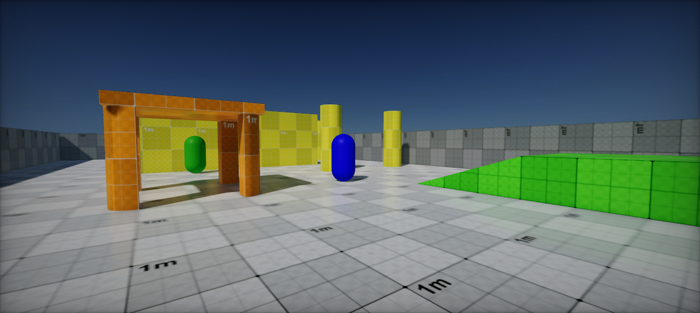

# Arizona Framework



Ready to use, open-source framework for creating games in Flax.

## Features

* Core game architecture concepts
  * Game Mode and Game State
  * Player State, Player Pawn and Player UI
* Multiplayer-ready (server-client infrastructure with optional local co op)
* Extendable (eg. via `GameSystem` or `GameSceneSystem`)
* Debug UI ([ImGui](https://github.com/FlaxEngine/ImGui))

Minimum supported Flax version: `1.5`.

## Sample project

See the open-source [Arizona Framework Sample](https://github.com/FlaxEngine/ArizonaFrameworkSample) project that showcases Arizona Framework usage in a simple first-person shooter game with multiplayer.

## Installation

0. Ensure to have proper system setup for C++ Scripting - see [Flax Docs](https://docs.flaxengine.com/manual/scripting/cpp/index.html)

1. Clone repo into `<game-project>\Plugins\ArizonaFramework` (with submodules: `git submodule update --init --recursive`)

2. Add reference to Arizona Framework project in your game by modyfying your game `<game-project>.flaxproj` as follows:

```
...
"References": [
    {
        "Name": "$(EnginePath)/Flax.flaxproj"
    },
    {
        "Name": "$(ProjectPath)/Plugins/ArizonaFramework/ArizonaFramework.flaxproj"
    }
]
```

3. Add reference to *ArizonaFramework* module in your game build script (eg. `Game.Build.cs`) as follows:

```cs
/// <inheritdoc />
public override void Setup(BuildOptions options)
{
    base.Setup(options);

    BuildNativeCode = false;
    options.ScriptingAPI.IgnoreMissingDocumentationWarnings = true;

    // Add reference to ArizonaFramework
    options.PrivateDependencies.Add("ArizonaFramework");
}
```

4. Create new `Game Instance Settings` (linked to Game Settings by Editor).

Ensure to have [Network Settings](https://docs.flaxengine.com/manual/networking/high-level.html#network-settings) setup.

5. Customize it

Now you can use *Arizona Framework* in your project. Use created `Game Instance Settings` asset to define your game mode, player pawn and other types to control the game data and logic.

## License

Both this plugin and ImGui are released under **MIT License**.

## Core Components

### Game Instance

Main game singleton plugin that manages the game systems and handles Game Mode setup and lifetime for the play.

### Game System

Gameplay system component attached to the Game Instance. Lifetime tied with the game.

### Game Scene System

Scene gameplay component attached to the Game Instance. Lifetime tied with the scene (created for each loaded scene).

### Game Mode

Main, root system of the game that implements the logic and flow of the gameplay. Exists only on server. Handles clients joining and spawning them on the level with local-client authority. Controls the limit of the players on a map, team sizes, allowed weapons and characters. Controls bots and spectators, but also level changes. Persists between scene changes.

### Game State

Global gameplay state container, maintained by server and replicated into all clients. Allows clients to access a list of players or gameplay conditions state (eg. current match score, elapsed game time).

### Player State

Player gameplay state container, maintained by server and replicated into all clients. Allows clients to access each player information (eg. name, score, ping, team, isSpectator, isBot).

### Player Pawn

Player actor on a scene (eg. prefab) that represents it in the game. Replicated to all clients (depending on the relevance) and owned by the server (simulated based on controller inputs). Locally simulated pawn can use autonomous replication mode to allow using locally playing human inputs for smooth gameplay but will still be validated against server state to prevent cheating.

### Player Controller

Player inputs controller that receives input from the player and converts it into movement for pawn. Exists on owning-client and is replicated on server-only.

### Player UI

Player User Interface with HUD. Exists only on local clients and is using Player State with Game State to inform players about the gameplay.

## Architecture

* Game Instance (GamePlugin)
  * Game System
  * Game Scene System
  * Game Mode
    * Player Pawn (script attached to spawned actor)
    * Player Controller (script attached to spawned actor)
    * Player UI (script attached to spawned actor)
  * Game State
    * Player State

## Game Systems

``GameSystem`` and ``GameSceneSystem`` are base types for custom gameplay systems that are tied with the game/scene lifetime. This allows quickly extending the gameplay with custom features such as Level Streaming, Weapons Manager, AI Manager, or other game systems/managers. ``GameSceneSystem`` is created once per loaded scene thus allowing to cache of scene-related data (eg. active entities).

Game Systems are created by Game Instance during game plugin initialization when the game starts. Each system can optionally skip with `CanBeUsed` method.

Example usage of `GameSystem` that loads game level when game connects to network server or main menu level on disconnect, it has cached list of Spawn Points for Game Mode to spawn players:

```cs
/// <summary>
/// Game levels manager that handles scene transitions (eg. joining game map after main menu connection).
/// </summary>
public class LevelsManager : GameSystem
{
    /// <summary>
    /// Gets the Levels Manager instance.
    /// </summary>
    public static LevelsManager Instance => GameInstance.Instance?.GetGameSystem<LevelsManager>();

    /// <summary>
    /// Active spawn points.
    /// </summary>
    public readonly List<SpawnPoint> SpawnPoints = new List<SpawnPoint>();

    /// <inheritdoc />
    public override void Initialize()
    {
        base.Initialize();

        NetworkManager.StateChanged += OnNetworkStateChanged;
    }

    /// <inheritdoc />
    public override void Deinitialize()
    {
        NetworkManager.StateChanged -= OnNetworkStateChanged;

        base.Deinitialize();
    }

    private void OnNetworkStateChanged()
    {
        // Select target scene to go to
        var mySettings = MySettings.Instance;
        var targetScene = mySettings.MainMenuLevel; // Go to menu by default
        if (NetworkManager.State == NetworkConnectionState.Connected)
        {
            targetScene = mySettings.GameLevel; // Go to the game level
        }

        // Load that scene (skip if already loaded)
        if (Level.FindActor(targetScene.ID) != null)
            return;
        Level.UnloadAllScenesAsync();
        Level.LoadSceneAsync(targetScene);
    }
}
```
